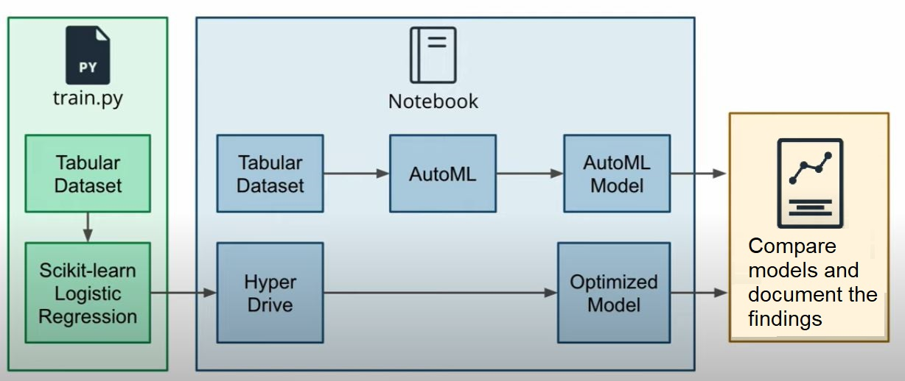
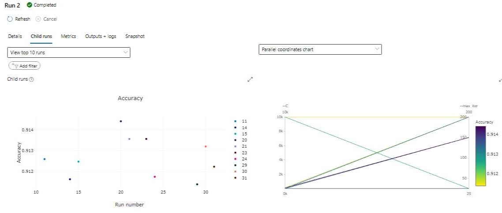
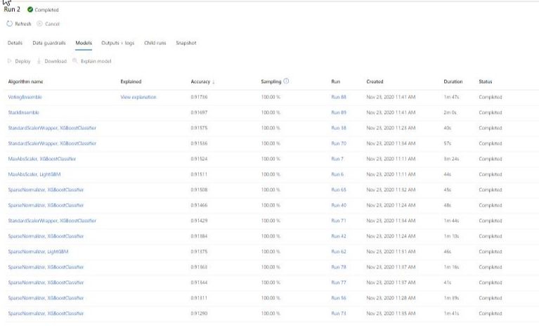
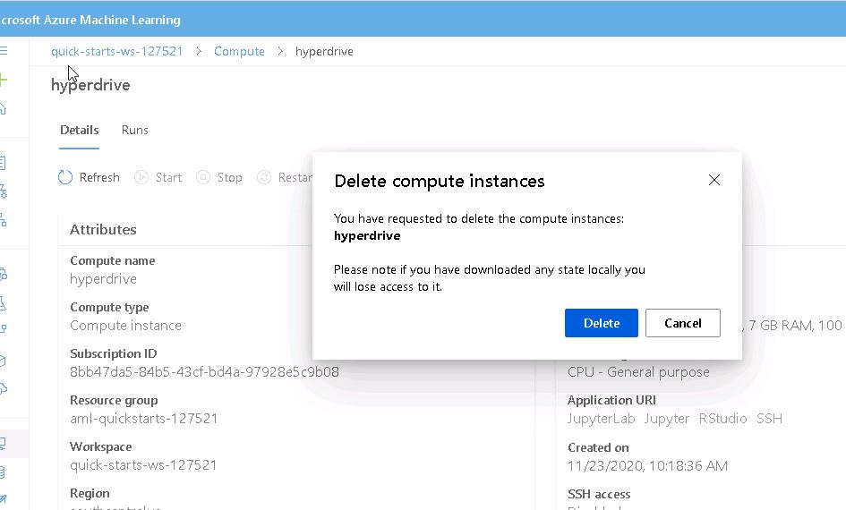

# Optimizing an ML Pipeline in Azure

## Overview
This project is part of the Udacity Azure ML Nanodegree.
In this project, I build and optimize an Azure ML pipeline using the Python SDK and a provided Scikit-learn model.
This model is then compared to an Azure AutoML run.
The image below shows the main processes involved in this .

## Summary
This dataset contains data from a Portuguese banking sector marketing campaign on phone calls, with input features-both 
categorical and numerical- like age, job, marital, education, housing,loan, contact, month and campaign etc.
 
The output label 'y' represents whether the marketing campaign was successful or not. This is clearly a classification problem since we have to predict the output as belonging to one of the two classes. We have to compare the classification accuracy of this problem using both hyperdrive and AutoML methods and see which one will be used for real-life scenarios.

## Solution
The best performing model was a Voting Ensemble Model in AutoML with an an accuracy of 91.736%

## Scikit-learn Pipeline
**Explain the pipeline architecture, including data, hyperparameter tuning, and classification algorithm.**

The dataset is created from CSV file link as a TabularDataset using TabularDatasetFactory. It is then cleaned and divided into training 
and test datasets using the train_test_split.

Azure Hyperdrive package helps to automate choosing  hyperparameter, which are adjustable parameters you choose for model training that guides the training process. Here we use 2 choice hyperparameters, Inverse regularization(C) and maximum iterations(max_iter) and a random sampling method over the search space.

1. Inverse regularization(C): (0.01, 0.1, 1, 10, 100, 1000, 10000) 
2. Maximum iterations: (25,90,150,200)

A primary metric "Accuracy" is specified, which must be maximized to optimize the hyperparameter tuning experiment.

**Benefits of the parameter sampler:** 
In Random sampling algorithm parameter values can be chosen from a set of discrete values or a distribution over a continuous range.
Random sampling supports early termination of low-performance runs. We can  users do an initial search with random sampling and then refine the search space to improve results.

Random sampling is preferred here over other parameter sampling classes like GridParameterSampling- supports only choice parameters, and 
should only be used if you can budget to exhaustively search over the search space, and  Bayesian Sampling-which does not support early termination policies. 

**Benefits of the early stopping policy:**
I used a BanditPolicy with evaluation_interval of 5 and slack_factor of 0.1. 
Since early termination policies cause the poorly performing experiment runs to be cancelled so any run 
that doesn't fall within the slack factor or slack amount of the evaluation metric with respect to the best performing run will be terminated. This means that after every 5 intervals, any run with its accuracy less than the best performing run's accuracy 
minus slack_factor 0.1 will be terminated.
This saves us computational time since low-performance runs will be terminated.

Classification algorithm is Logistic Regression which is implemented with scikit learn.

## AutoML
 

Automated machine learning allows us to build ML models with high scale, efficiency, and productivity all while sustaining model quality. 
The data is first uploaded as a tabular dataset so it can be used by automl compute.

In AutoML config, we set the  experiment timeout in minutes to be 30, iterations to be 100, maximum concurrent iterations to 8 and
number of cross-validations to be 5. Task is classification and primary metric is accuracy. Since 5 folds cross validations are being performed, so for each training we use 4/5 th of data and 1/5 th of data is used in each validation with a different holdout fold each time.

AutoML tries different models leke MaxAbsScaler LightGBM, MinMaxScaler RandomForest, StandardScalerWrapper ExtremeRandomTrees etc 
for 83 iterations and comes up with top 2 contenders:
1. Voting Ensemble with 91.736% accuracy (this will be chosen)
2. Stack Ensemble with 91.697% accuracy

## Pipeline comparison

### Hyperdrive Output:
The model ran for about 15 minutes and gave an accuracy of 91.44%.
The best hyperparameters were:
  Inverse Regularization Strength:': 100.0,
 'Max iterations:': 150,
 'Accuracy': 0.91442097596504
Since we used a random search parameter so the accuracy fluctuated in the  below.

### AutoML Output:
It ran for about 42 minutes, and the accuracy was slightly better than Hyperdrive's output since it tried many different
algorithms.
Accuracy was 91.736% which when compared with Hyperdrive shows an improvement of 0.319% overall at the cost of 27 more minutes,
so this increase in accuracy is not as significant when compared to the amount of time consumed.
The top models by accuracy are given :

If we had to choose one method from the above two, the following use cases should be kept in mind:
1. If one wants to obtain great results and time is not an issue, and little knowledge of programming one can use AutoML. Instead of 
choosing a model yourself, AutoML can give which model performance is best.
2. If one has knowledge of which models can perform best(if one is familiar with ML), and wants to achieve great results with less time
consumption, one can use Hyperdrive.

## Future work
**What are some areas of improvement for future experiments? Why might these improvements help the model?**

 Here we used LogisticRegression classifier in hyperdrive, other models can perform even better.
 Deep Learning Models can also be used.
 AutoML run gives a class imbalance alert. Imbalanced data can lead to a falsely perceived positive effect of
 a model's accuracy because the input data has bias towards one class.
 To rectify this, we can resampling to even the class imbalance first.
 
 
## 

